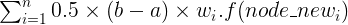
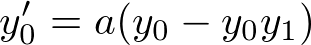
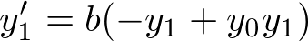
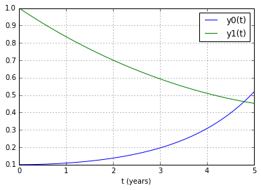
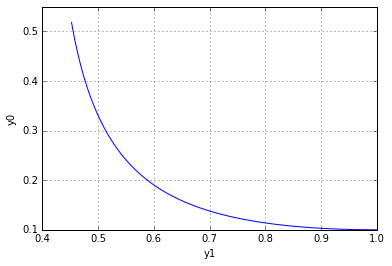
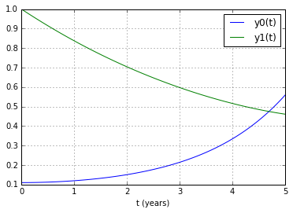
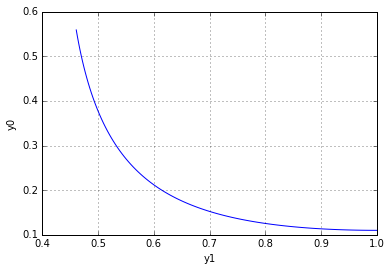

UECM3033 Assignment #3 Report
========================================================

- Prepared by: Chua Khang Hui
- Tutorial Group: T2

--------------------------------------------------------

## Task 1 --  Gauss-Legendre formula

The reports, codes and supporting documents are to be uploaded to Github at: 

[https://github.com/ChuaKhangHui/UECM3033_assign3](https://github.com/ChuaKhangHui/UECM3033_assign3)

Explain how you implement your `task1.py` here.

Task1 will required the using of numpy.polynomial.legendre.leggauss(deg) which will return the node and weight for each node.
Then a transformation of node is need to transform form the function default domain, [-1,1] to the domain we interested, [a,b]
let name the node after transform 'new_node'
then the integration will be compute by calculating

where w = weight, n = number of nodes

Explain how you get the weights and nodes used in the Gauss-Legendre quadrature.

Weight and nodes can be get by numpy.polynomial.legendre.leggauss(deg) where deg is the number of nodes
nodes will be go through a transformation to match the domain we interested.
---------------------------------------------------------

## Task 2 -- Predator-prey model

Explain how you implement your `task2.py` here, especially how to use `odeint`.

For task 2, the ordinary differentiate equation and the initial state must be define then pass into the odeint function. 
The basic usage of odeint is `odeint(func, y0, t, args=(a, b))`, where func is a function definition of the derivative of y at t0, y0 is the initial state, t is the time points for which to solve for y, and args is extra arguments to pass to function.

In our case, function will define the differential equations

y0 is the initial state of \[y0(0),y1(0)], t will be the time point from 0 to 5years, and args(a,b) will be \[1.0, 0.2].

By fitting all these parameters into `odeint`, it will return the state of y at all the time points.

Next, plot the graph of the state of both y0 and y1 at each time points. As shown below
  

we can observe that the number of y0 is decreasing while the number of y1 is decreasing over these 5 years period.

Another graph of y1 against y0 is plotted as followed:
  

Is the system of ODE sensitive to initial condition? Explain.

Here, the initial condition of y0 is slightly increase from 0.1 to 0.11.
The same group mentained above is plotted as shown below:
  

Here, we can see that the system is not sensitive to initial condition as the pattern of the graph still preserved.

-----------------------------------

last modified: 17/4/2016
